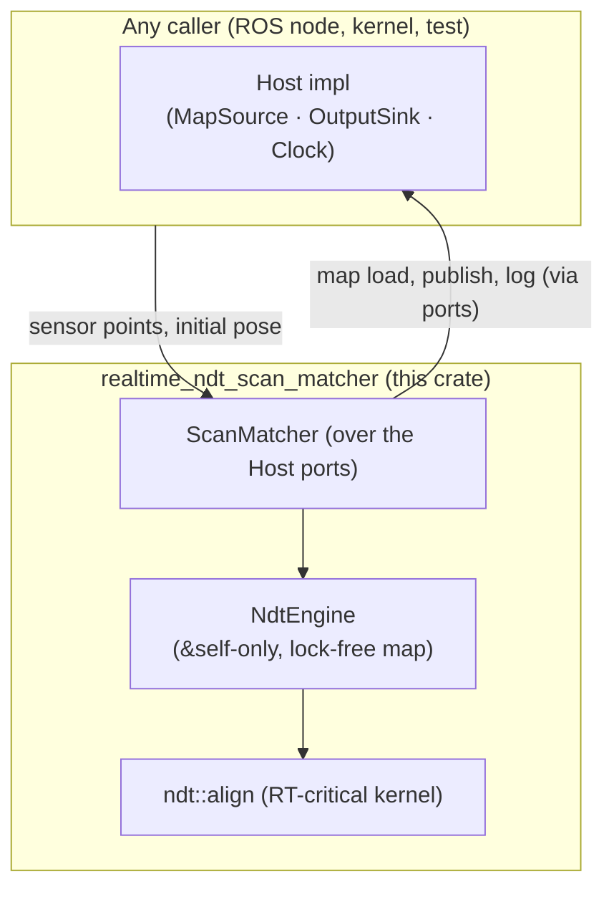

# Introduction

This book documents **`realtime_ndt_scan_matcher`** — the ROS-free, `no_std`-capable **NDT
engine crate** at the heart of the Autoware NDT scan matcher's Rust port. It is written for the
people who build on, review, and maintain the *algorithm*: the engine, the align hot path, the
covariance/pose search, and the real-time / `no_std` guarantees.

The engine crate holds **only** the portable algorithmic core — no `extern "C"`, no `rclcpp`, no
ROS message types. The C ABI and the ROS 2 node live in the sibling **node crate**
(`autoware_ndt_scan_matcher_rs`), documented in its own book; that book covers the FFI boundary,
the `Host` vtable, the ROS node shell, and the C++→Rust symbol map. The two crates form a Cargo
workspace:

| crate | directory | role |
|---|---|---|
| `realtime_ndt_scan_matcher` (this book) | `autoware_ndt_scan_matcher_rs/realtime_ndt_scan_matcher/` | portable NDT engine (`no_std` + `alloc`, ROS-free) |
| `autoware_ndt_scan_matcher_rs` | `autoware_ndt_scan_matcher_rs/` | C ABI + ROS 2 node shell (`std`), depends on the engine |

## Why this crate exists

- **Panic-free, WCET-bounded real time.** The align hot path is allocation-free after warmup,
  has a documented worst-case execution-time contract, and cannot panic.
- **A `no_std` / kernel target.** The same engine builds without `std`
  (`--no-default-features`), so it can run under a bare-metal kernel — the portability goal that
  shaped the whole design. The `mt` feature adds a multi-core, `Sync` engine.
- **Reusability.** Because the engine is ROS-free and pure Rust, it can be consumed directly by
  Rust callers (see the `examples/` and `tests/`) as well as by the ROS node over FFI.

## What is and isn't in scope

**In scope (this crate):** the NDT engine and voxel-grid map, the align kernel, scores
(transform probability and nearest-voxel likelihood), covariance estimation, the align-service
pose search (TPE), pose buffers, the convergence verdict, and the `Host` port traits that let a
caller supply the map, clock, and output sink.

**Out of scope (the node crate / `rclcpp`):** the C ABI, ROS node construction,
publishers/subscribers/services/timers, parameter declaration, TF lookup, the map-loader service
call, and message publication. This crate never links `rclcpp` and never touches ROS types; a
caller drives it through the `Host` traits.

## The shape of the engine

Read [How to read this book](reader-map.md) next — it routes each kind of reader to the chapters
that matter most.
