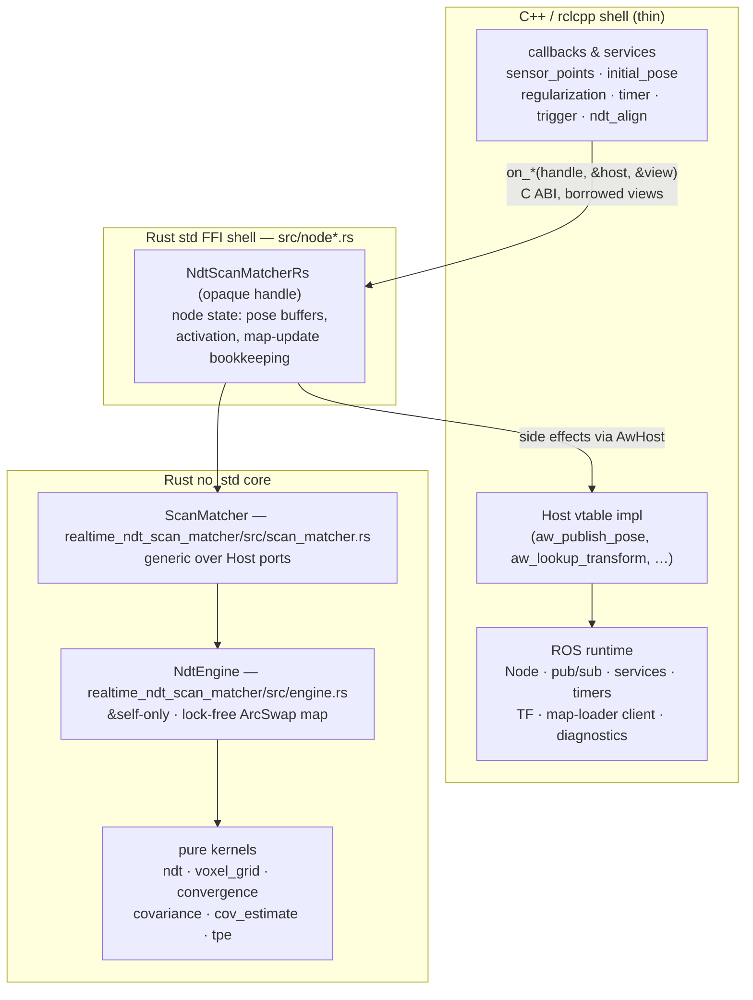

# System overview

The port splits cleanly along one line: **C++ owns the ROS 2 runtime; Rust owns the algorithm.**
The two meet at a narrow C ABI where C++ calls one Rust `on_*` function per callback, and Rust
requests ROS side effects back through a host vtable.

## Layers



## The two Rust crates

The Rust side is deliberately **two crates** in one Cargo workspace, because the same core must run
under a `no_std` kernel:

1. **Engine crate — `realtime_ndt_scan_matcher` (`no_std` + `alloc`, ROS-free).** `ScanMatcher` is
   generic over the [host ports](host-vtable.md) and wraps the persistent `NdtEngine`. No ROS, no
   FFI, no `std`. It reuses the pure `convergence` / `covariance` / `cov_estimate` kernels. This is
   the kernel (Track-B) target, and it has its own book. Its `lib.rs` carries
   `#![cfg_attr(not(any(test, feature = "std")), no_std)]`.
2. **Node crate — `autoware_ndt_scan_matcher_rs` (always `std`).** `NdtScanMatcherRs` is the opaque
   handle C++ holds. It depends on the engine crate, owns the *node-level* state the engine does not
   (pose buffers, activation flag, map-update bookkeeping), and adapts everything to the C ABI in
   its `node` / `node_handle` / `node_map_update` / `node_align_service` modules. It is never part of the `no_std`
   build.

New algorithmic code goes in the engine crate so the kernel build keeps it; only ROS/FFI glue lives
in the node crate.

## The opaque handle

C++ never knows the layout of `NdtScanMatcherRs`. It holds an `AwNdtScanMatcher *` behind a
C++ RAII wrapper (`NDTScanMatcherRS`) that calls `autoware_ndt_scan_matcher_rs_new` /
`_free`. The final C++ callback body is just:

```cpp,ignore
void NDTScanMatcher::callback_sensor_points(
  sensor_msgs::msg::PointCloud2::ConstSharedPtr msg)
{
  AwHost host = make_host();
  AwPointCloud2View view = make_pointcloud2_view(*msg);
  autoware_ndt_scan_matcher_rs_on_sensor_points(rs_.raw(), &host, &view);
}
```

The next chapters go down each seam: the [FFI boundary](ffi-boundary.md), the
engine, and the align hot path.

> Source: `src/lib.rs`, `realtime_ndt_scan_matcher/src/scan_matcher.rs`, `realtime_ndt_scan_matcher/src/engine.rs`.
