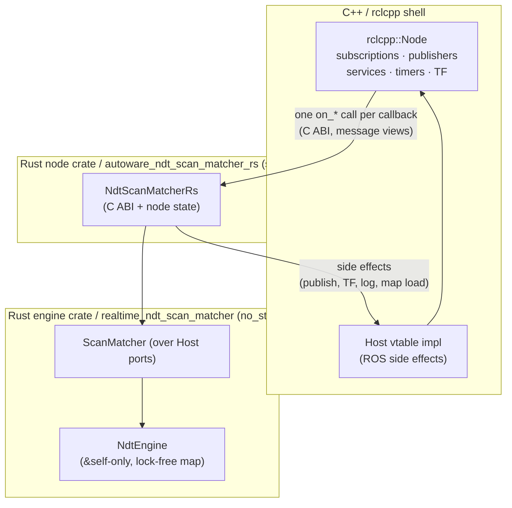

# Introduction

This book documents the **Rust port of the Autoware NDT scan matcher**
(`autoware_ndt_scan_matcher`). It is written for the people who build on, review, and
maintain the port — not as a user manual for the ROS node (see the package
[`README.md`](https://github.com/autowarefoundation/autoware_core) for node I/O and
parameters).

The port keeps `rclcpp` as the ROS 2 runtime and moves the *algorithmic core* — the NDT
engine, scan-matching state, convergence judgement, covariance estimation, map-update
decisions, and callback bodies — into Rust, split across two crates in one Cargo workspace:

- **`realtime_ndt_scan_matcher`** — the ROS-free, `no_std`-capable **engine** (the algorithm).
  It has its own book under `realtime_ndt_scan_matcher/doc/book/`.
- **`autoware_ndt_scan_matcher_rs`** (this book) — the **node crate**: the C ABI over the engine's
  Rust API plus the `std` ROS 2 node shell.

The C++ side becomes a thin shell that owns only the ROS 2 boundary and forwards each
callback to a single Rust entry point in the node crate.

## Why this exists

- **Memory safety at the boundary.** Every pointer and struct that crosses the C ABI is
  validated on the Rust side before use.
- **Panic-free, WCET-bounded real time.** The align hot path is allocation-free after
  warmup, has a documented worst-case execution-time contract, and cannot panic.
- **A `no_std` / kernel target.** The same algorithm core builds without `std`, so it can
  run under a bare-metal kernel — a portability goal that shaped the whole design.

## What is and isn't in scope

**In scope (Rust):** the NDT engine and voxel-grid map, the align kernel, scores
(transform probability and nearest-voxel likelihood), covariance estimation, the align-service
pose search, pose buffers, convergence, map-update policy, and diagnostics content.

**Out of scope (stays C++ / `rclcpp`):** node construction, publishers/subscribers/services/
timers, parameter declaration, TF lookup, the map-loader service call, and actual message
publication. Rust never links `rclcpp` and never subscribes to topics; it requests ROS side
effects through a host vtable that C++ implements.

## The shape of the system

Read [How to read this book](reader-map.md) next — it routes each kind of reader to the
chapters that matter most for them.
